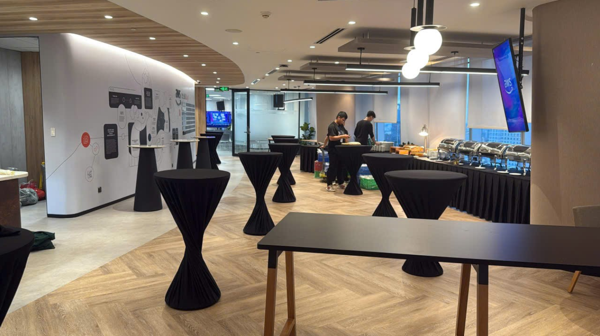

# Bài Thu Hoạch: "Kick-off AWS FCJ Workforce OJT FALL 2025"

## Thông Tin Sự Kiện

| Thuộc Tính       | Chi Tiết                                                          |
| ---------------- | ----------------------------------------------------------------- |
| **Tên Sự Kiện**  | Kick-off AWS FCJ Workforce OJT FALL 2025                          |
| **Ngày Tổ Chức** | Ngày 06 tháng 11 năm 2025                                         |
| **Địa Điểm**     | Phường Bến Nghé, Quận 1, Trung Tâm Thành Phố Hồ Chí Minh          |
| **Chủ Đề**       | Khởi động AWS FCJ Workforce OJT FALL 2025                         |
| **Định Dạng**    | Thuyết trình từ chuyên gia, các trường hợp thực tế, phiên hỏi đáp |

---

## Mục Đích Của Sự Kiện

- **Giới thiệu chương trình FCJ Workforce OJT** - cấu trúc, lịch trình và kết quả học tập
- **Chia sẻ các best practices trong ngành** về thiết kế ứng dụng hiện đại và kiến trúc cloud

---

## Các Diễn Giả Nổi Bật & Chuyên Môn Của Họ

| Diễn Giả            | Chức Vụ                                                   |
| ------------------- | --------------------------------------------------------- |
| **Nguyễn Gia Hùng** | Trưởng Bộ Phận Kiến Trúc Giải Pháp - Việt Nam & Campuchia |

---

## Trải Nghiệm Sự Kiện

### Kết Nối và Trao Đổi

**Các Hoạt Động Xây Dựng Cộng Đồng:**

**Cơ Hội Kết Nối:**
- Gặp gỡ các chuyên gia AWS và các mentor
- Kết nối với các thành viên FCJ khác
- Thảo luận về các dự án thực tế và thách thức
- Trao đổi thông tin liên hệ để hợp tác trong tương lai

**Phiên Hỏi Đáp:**
- Đặt các câu hỏi làm rõ về các khái niệm kỹ thuật
- Thảo luận các cân nhắc khi triển khai
- Nghe về các tình huống cần tránh thường gặp
- Nhận lời khuyên cá nhân từ các chuyên gia

**Thảo Luận Với Các Bạn Cùng Khóa:**
- Chia sẻ quan điểm về các thách thức hiện đại hóa
- Thảo luận cách áp dụng các khái niệm vào các bối cảnh khác nhau
- Thành lập các nhóm học tập để tiếp tục học tập
- Thiết lập các đối tác để giữ trách nhiệm với nhau

### Những Bài Học Rút Ra

**Những Bài Học Chuyên Môn:**

1. **Tư Duy Hướng Kinh Doanh**
   - Luôn hiểu vấn đề kinh doanh trước tiên
   - Căn chỉnh các quyết định kỹ thuật với mục tiêu kinh doanh
   - Truyền đạt giá trị bằng các thuật ngữ kinh doanh
   - Sự hỗ trợ của các bên liên quan là rất quan trọng để thành công

2. **Sức Mạnh Của Mô Hình Hóa Trực Quan**
   - Event storming mang lại sự rõ ràng tức thì
   - Mô hình hóa hợp tác căn chỉnh sự hiểu biết
   - Các sơ đồ trực quan giao tiếp tốt hơn so với các tài liệu
   - 2-3 giờ mô hình hóa tiết kiệm hàng tuần lỗi thiết kế

3. **Cộng Đồng và Hướng Dẫn Rất Quan Trọng**
   - Việc học tập tăng tốc độ với hướng dẫn của chuyên gia
   - Sự hỗ trợ của bạn bè giúp vượt qua các thách thức
   - Các quan điểm đa dạng cải thiện các giải pháp
   - Các mối quan hệ xây dựng cho phép hợp tác liên tục

### Một Số Hình Ảnh Sự Kiện

