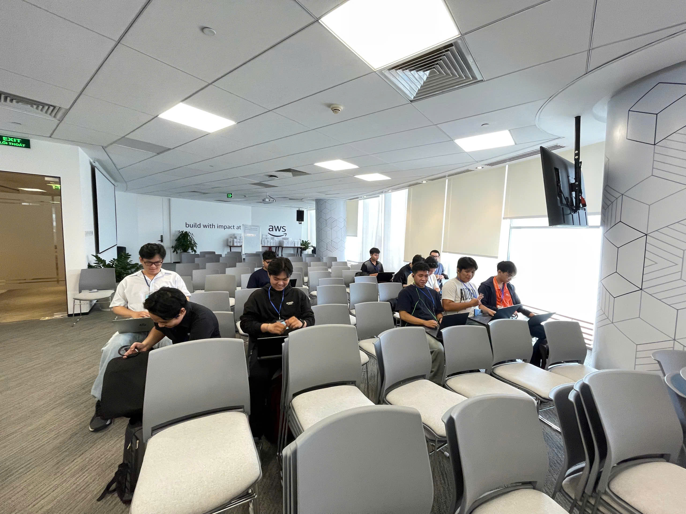

# Bài Thu Hoạch: "Vietnam Cloud Day 2025: Ho Chi Minh City Connect Edition for Builders"

## Thông Tin Sự Kiện

| Thuộc Tính       | Chi Tiết                                                              |
| ---------------- | --------------------------------------------------------------------- |
| **Tên Sự Kiện**  | Vietnam Cloud Day 2025: Ho Chi Minh City Connect Edition for Builders |
| **Ngày Tổ Chức** | Thứ năm, 18 tháng 9 năm 2025                                          |
| **Địa Điểm**     | Phường Bến Nghé, Quận 1, Trung Tâm Thành Phố Hồ Chí Minh              |
| **Chủ Đề**       | Xây Dựng Tương Lai: Đổi Mới Đám Mây & Kết Nối Cộng Đồng               |

---

## Mục Đích Của Sự Kiện

- **Giới thiệu các đổi mới công nghệ AWS đám mây** và các công nghệ tiên tiến nhất trên thị trường Việt Nam
- **Kết nối các nhà xây dựng và lập trình viên Việt Nam** với các chuyên gia AWS và cộng đồng
- **Chia sẻ các trường hợp thực tế** từ các công ty Việt Nam đạt thành công trên đám mây
- **Xây dựng cộng đồng nhà xây dựng** và khuyến khích phát triển tài năng công nghệ địa phương
- **Thể hiện giá trị kinh doanh** của quá trình chuyển đổi đám mây và chuyển đổi số
- **Truyền cảm hứng đổi mới** và giới thiệu các công nghệ mới nổi (AI/ML, serverless, containers)
- **Xây dựng hệ sinh thái địa phương** hỗ trợ các công ty khởi nghiệp và doanh nghiệp Việt Nam

---

## Trải Nghiệm Sự Kiện

### Học Hỏi Từ Các Lãnh Đạo Ngành

### Trải Nghiệm Thực Tế

**Học Tập Có Giá Trị Nhất:**
> "Phát triển đám mây không còn là về máy chủ nữa. Nó là về tập trung vào logic kinh doanh của bạn trong khi AWS xử lý cơ sở hạ tầng. Điều này giải phóng các nhà phát triển để đổi mới nhanh hơn."

### Kết Nối & Cộng Đồng

**Các Kết Nối Được Thực Hiện:**
- Gặp gỡ 50+ nhà phát triển và kiến trúc sư
- Kết nối với 5 cộng tác viên tiềm năng
- Tìm mentor trong cộng đồng AWS
- Tìm hiểu về cơ hội khởi nghiệp
- Kết bạn trong cộng đồng nhà xây dựng
- Trao đổi thông tin liên hệ cho các dự án trong tương lai

**Các Nguồn Lực Cộng Đồng Được Khám Phá:**
- Kênh Slack Cộng Đồng Nhà Xây Dựng AWS Việt Nam
- Các cuộc họp trực tuyến hàng tuần
- Các cuộc tụ tập theo tháng
- Các tài nguyên kỹ thuật và workshop
- Chương trình ghép nối cố vấn
- Bảng công việc và các cơ hội nghề nghiệp

### Những Bài Học Rút Ra

**Những Bài Học Kỹ Thuật:**

1. **Bắt Đầu Đơn Giản, Mở Rộng Quy Mô Thông Minh**
   - Bắt đầu với giải pháp đơn giản nhất (serverless)
   - Chỉ thêm độ phức tạp khi cần thiết
   - Đo lường và tối ưu hóa dựa trên dữ liệu thực
   - Over-engineering tốn kém hơn under-engineering

2. **Cơ Sở Hạ Tầng Dưới Dạng Mã Không Phải Là Tùy Chọn**
   - Cơ sở hạ tầng thủ công dễ bị lỗi
   - Mã cho phép tái tạo và khôi phục thảm họa
   - Kiểm soát phiên bản các thay đổi cơ sở hạ tầng
   - Hợp tác trở nên dễ dàng hơn với IaC
   - Cho phép kiểm tra tự động cơ sở hạ tầng

3. **Giám Sát Quan Trọng Hơn Bạn Nghĩ**
   - Bạn không thể cải thiện những gì bạn không đo lường được
   - Khả năng hiển thị theo thời gian thực ngăn chặn vấn đề
   - Dữ liệu lịch sử cho phép tối ưu hóa
   - Cảnh báo giữ bạn thông báo, không hoảng loạn
   - Khả năng quan sát tốt làm cho gỡ lỗi dễ dàng hơn 10 lần

**Những Bài Học Chuyên Môn:**

4. **Mạng Lưới Là Tài Sản Lớn Nhất Của Bạn**
   - Hầu hết các cơ hội đến qua các mối quan hệ
   - Hỗ trợ cộng đồng tăng tốc độ học tập
   - Lời khuyên từ bạn bè ngăn chặn những sai lầm tốn kém
   - Các mentor mở cửa
   - Hợp tác nhân lên năng suất

5. **Các Nhà Xây Dựng Việt Nam Là Tầm Thế Giới**
   - Thấy các bạn đồng nghiệp xây dựng các giải pháp ấn tượng
   - Tài năng Việt Nam có sức cạnh tranh toàn cầu
   - Hệ sinh thái địa phương đang phát triển mạnh
   - Có nhiều cơ hội cho các nhà xây dựng
   - Tự hào là một phần của cộng đồng đang phát triển

6. **Đám Mây Chuyển Đổi Hơn Cả Công Nghệ**
   - Các mô hình kinh doanh thay đổi với đám mây
   - Các tổ chức có thể linh hoạt hơn
   - Đổi mới trở nên nhanh hơn và rẻ hơn
   - Cạnh tranh toàn cầu bây giờ là địa phương
   - Thành công đòi hỏi thay đổi tư duy, không chỉ công cụ

### Một Số Hình Ảnh Sự Kiện

---