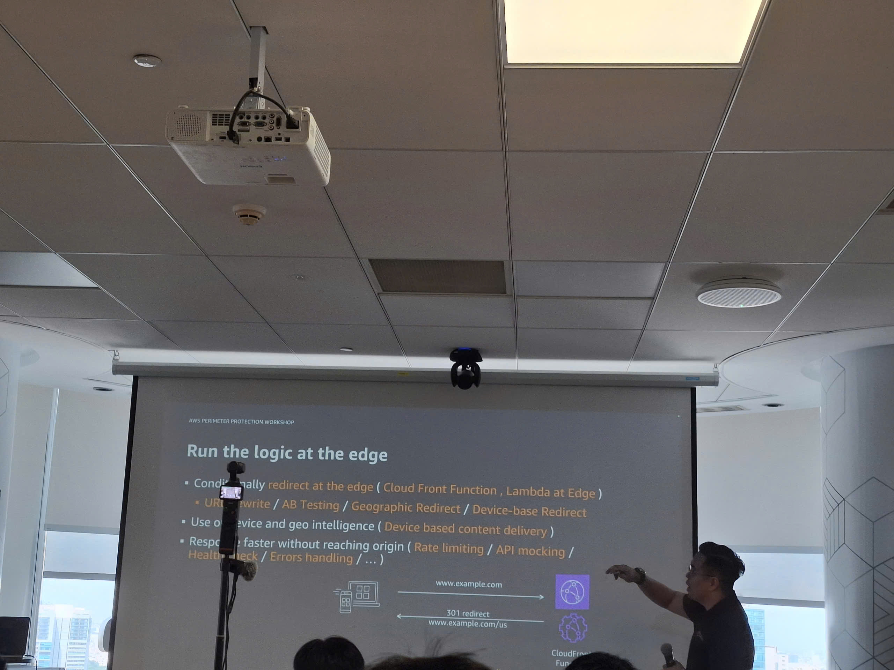

# Summary Report: "AWS Cloud Mastery Series #2: DevOps, IaC & Container Orchestration"

## Event Information

| Attribute      | Details                                                                  |
| -------------- | ------------------------------------------------------------------------ |
| **Event Name** | AWS Cloud Mastery Series #2: DevOps, IaC & Container Orchestration       |
| **Date**       | December 17, 2025                                                        |
| **Location**   | AWS Innovation Hub, Ho Chi Minh City                                     |
| **Theme**      | Building Scalable and Reliable DevOps Practices on AWS                   |
| **Duration**   | 8.5 hours (8:30 AM - 5:00 PM)                                            |
| **Format**     | Workshop sessions, live presentations, case studies, hands-on exercises  |
| **Attendees**  | Developers, DevOps engineers, architects, platform engineers, tech leads |

---

## Event Experience

### Comprehensive Learning Journey

**The workshop provided a holistic view of DevOps on AWS**, covering everything from cultural foundations to real-world technical deployment. Rather than just listing tools, it addressed the "why" behind DevOps and the business value it creates.

**Most Impactful Insights:**

1. **DevOps Is a Mindset, Not Just Technology**
   - The emphasis on DevOps Three Ways of Working and DORA Metrics showed that DevOps success is about organizational culture and mindset
   - Technical tools matter, but only when the right culture exists

2. **Automation Enables Speed and Safety**
   - Clearly saw how manual deployments take hours and are error-prone
   - While automated deployments take only minutes and are always consistent

3. **Real Companies Face Real Challenges**
   - Case studies from Vietnamese startups and enterprises
   - Showed relatable challenges and achievable transformations

4. **DevOps Accelerates Business Value**
   - Metrics: deployment frequency increased 10x, time-to-market cut in half, revenue growth from faster features
   - DevOps is a business enabler, not just IT efficiency

### Practical Skills Demonstrated

- Build complete CI/CD pipelines
- Write Infrastructure as Code
- Package applications
- Set up monitoring and observability
- Deploy deployment strategies
- Manage incidents effectively
- Design for reliability and resilience

### Community & Connections

**Connections Made:**
- Met 40+ DevOps engineers and architects
- Found mentors in the AWS community
- Connected with peers at similar career stages
- Exchanged contact info for future DevOps projects

**Vietnamese DevOps Community:**
- Rapidly growing community (500+ members)
- Weekly online meetups on DevOps
- Regular workshops and webinars
- Collaboration opportunities on real projects

### Lessons Learned

**Technical Lessons:**

1. **DevOps Is a Cultural Mindset**
   - Not just tools and automation
   - Requires cultural change
   - Breaking down silos between teams
   - Leads to business value

2. **Automation Drives Success**
   - Manual processes don't scale
   - Every step must be automated
   - Testing must be automated
   - Deployments must be one-click
   - Enables rapid iteration

3. **Observability Is Essential**
   - You cannot improve what you cannot measure
   - Monitoring is a prerequisite
   - Tracing helps debug issues
   - Real-time visibility is critical
   - Make decisions based on data

4. **Infrastructure as Code**
   - Infrastructure should be version controlled
   - Deployments are reproducible
   - Disaster recovery becomes feasible
   - Consistency across environments
   - Team collaboration is easier

5. **Containers Are Standard**
   - Microservices are built on containers
   - Standardized deployment units
   - Scaling becomes granular
   - Multi-cloud portability
   - DevOps best practices

---

## Conclusion

**AWS Cloud Mastery Series #2 provides a solid foundation in DevOps:**
- **Practical skills** from day one
- **Expert guidance** from industry professionals
- **Strong community network** for support
- **Clear career opportunities** in DevOps field

### Some Event Photos

